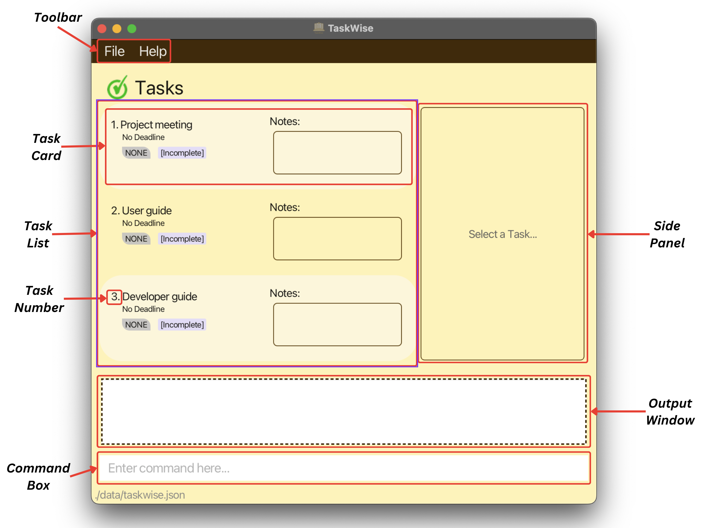
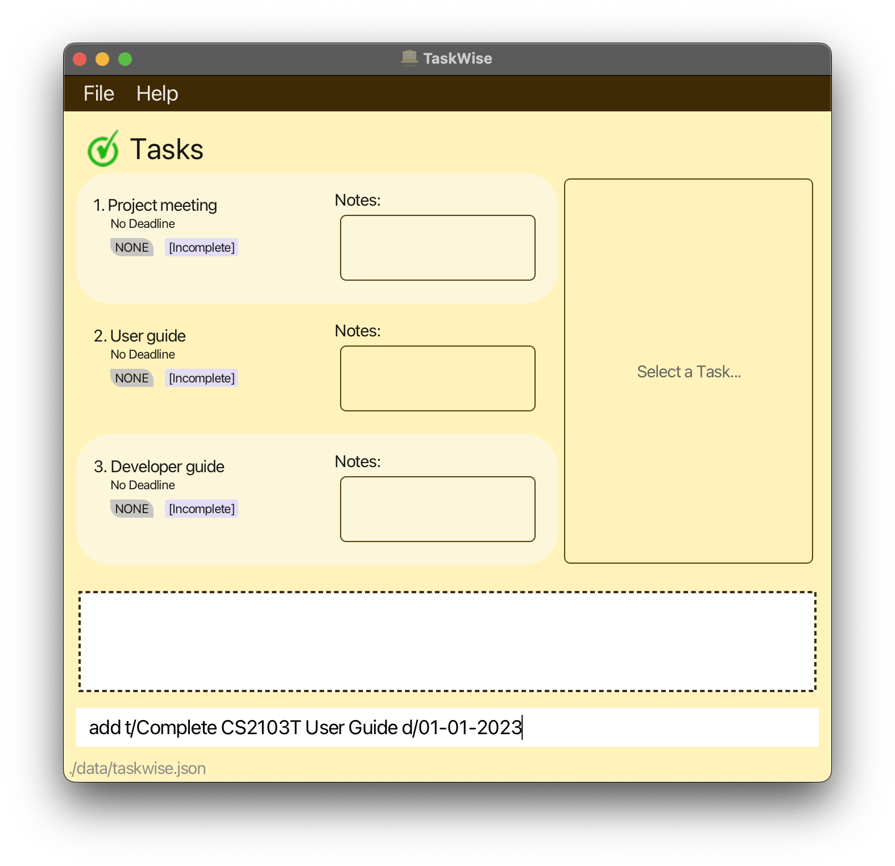
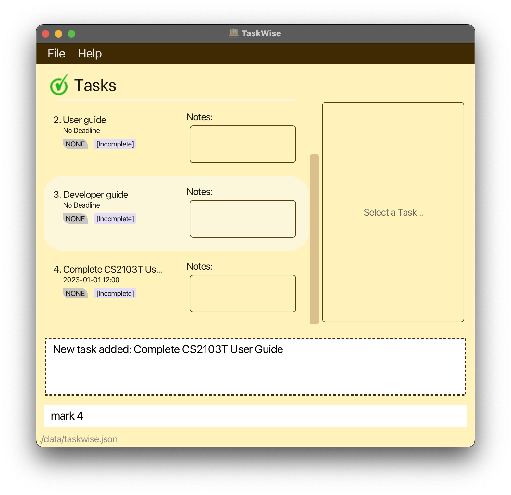
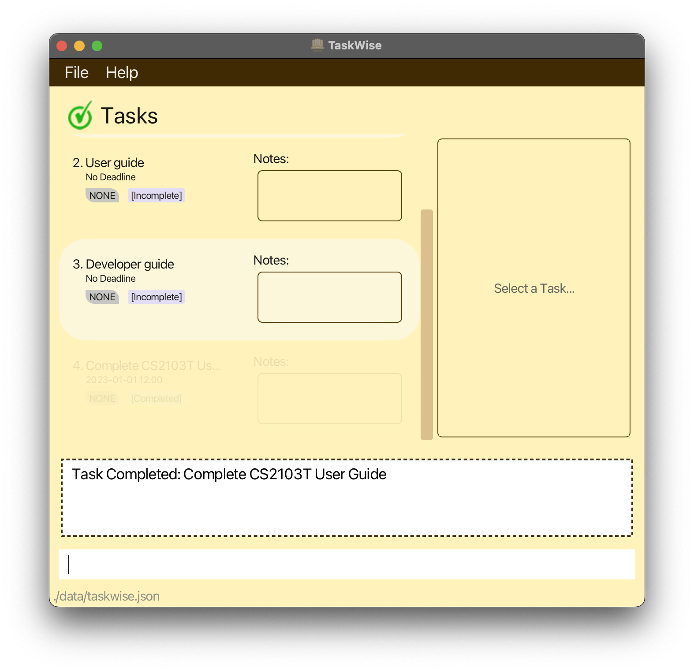

Welcome to the TaskWise User Guide!

TaskWise is a GUI/CLI program made for **CS2103T Project Managers** to help them keep track of and manage their project tasks.

Here's a quick summary of what TaskWise can do for you:

* All features are easily achieved using simple, typed commands!
* Reminders on how each command can be used!
* Add tasks into TaskWise and keep track of them!
* Add useful information like deadlines and priorities to each of your tasks!
* Reorder the tasks within the list at will to meet your needs!

## Table of Content

- [Introduction](#introduction)
  - [Usage of User Guide](#usage-of-user-guide)
- [Installation Guide](#installation-guide)
- [GUI Interface](#gui-interface)
- [Tutorial](#tutorial)
  - [Adding Your First Task](#adding-your-first-task)
  - [Marking Your First Task](#marking-your-first-task)
  - [Clearing Default Tasks](#clearing-default-tasks)
- [Features](#features)
  - [Prefixes](#prefixes)
  - [Getting Help](#getting-help)
  - [Add Tasks](#add-tasks)
  - [Mark Tasks as Complete](#mark-tasks-as-complete)
  - [Mark Tasks as Incomplete](#mark-tasks-as-incomplete)
  - [Add Notes to Tasks](#add-notes-to-tasks)
  - [Edit Tasks](#edit-tasks)
  - [View a Task](#view-a-task)
  - [Find a Task](#find-a-task)
  - [See All Tasks](#see-all-tasks)
  - [Sort Tasks](#sort-tasks)
  - [Delete Tasks](#delete-tasks)
  - [Clear All Tasks](#clear-all-tasks)
  - [Command Summary](#command-summary)
- [Planned Enhancements](#planned-enhancements)
  - [Ability To Add Tasks With The Same Description With Different Details](#ability-to-add-tasks-with-the-same-description-with-different-details)
  - [Inform User When Date Input Has Passed](#inform-user-when-date-input-has-passed)
  - [Edit Command - Different Modes](#edit-command---different-modes)
  - [Improve Find Command To Find By Priority, Deadline, Members and Notes](#improve-find-command-to-find-by-priority-deadline-members-and-notes)
  - [Case-insensitive Sort](#case-insensitive-sort)
  - [Case-insensitive Ordering of Members](#case---insensitive-ordering-of-members)
- [FAQ](#faq)
  - [General Questions](#general-questions)
  - [Task-Related Questions](#task-related-questions)

# Introduction

We've all been there. It's exam season, and all the project deadlines are coming! As your team's project manager, you will want to keep track of all the tasks that need to be done according to deadlines and priority levels.

TaskWise has a variety of features to help you do exactly just that! Download and install TaskWise today to start effortlessly managing your team's workload!

[[Jump to Table of Content]](#table-of-content)

## Usage of User Guide

This User Guide will guide you along in learning how to use TaskWise and what the different features of TaskWise are. If you are already an experienced user, click [here](#features) to jump straight to the summary of the different features of TaskWise and [here](#command-summary) to get to the summary of commands that you can enter into TaskWise.

Otherwise, just continue following the rest of the User Guide, from top to bottom, to fully learn and improve your project workflows with TaskWise!

One important thing before we jump into the guide, here are some things to note for you to understand the guide better. You might come across blocks of information that are coloured, and they are meant to highlight different kinds of information.

<div markdown="span" class="alert alert-info">
:information_source: The blue block highlights additional information that might be useful in clearing some confusion.
</div>

<div markdown="span" class="alert alert-warning">
:warning: The yellow block draws attention to crucial information that requires careful consideration to mitigate potential risks or challenges.
</div>

<div markdown="span" class="alert alert-danger">
:bangbang: The red block highlights information that requires immediate attention due to potential irreversible risks.
</div>

You would also come across various commands to interact with our app. These commands will be explicitly shown in the following format:

```
Text in this box is a command
```

The capitalised words that are encapsulated in `[SQUARE_BRACKETS]` are meant to be replaced with whatever is appropriate. You do not need to care about the appropriate values for now as they will be expounded later on, the only takeaway is that they are **NOT** meant to be copied word for word.

For example, for the following command,

```
add t/[TASK_DESCRIPTION]
```

you can replace `[TASK_DESCRIPTION]` with something else, such as:

```
add t/do OP2 slides
```

Note that the `[]` is not included as part of the command!

Lastly, words that are [blue](#blue) are hyperlinks that either lead to another site, or another section in this guide, which you can use to ease your navigation!

Now that we got the basics out of the way, let's jump right into the guide!

[[Jump to Introduction]](#introduction)

# Installation Guide

1. Ensure that you have Java 11 installed on your computer. Click [here](https://blog.hubspot.com/website/check-java-verison#:~:text=First%2C%20find%20and%20click%20on,get%20your%20current%20version%20details) to learn how to find out what Java version you have! If you do not have Java 11, you can download Java 11 by following the guide below:

- [Windows](https://docs.oracle.com/en/java/javase/11/install/installation-jdk-microsoft-windows-platforms.html#GUID-A7E27B90-A28D-4237-9383-A58B416071CA)
- [MacOS](https://docs.oracle.com/en/java/javase/11/install/installation-jdk-macos.html#GUID-2FE451B0-9572-4E38-A1A5-568B77B146DE)
- [Linux](https://docs.oracle.com/en/java/javase/11/install/installation-jdk-linux-platforms.html#GUID-737A84E4-2EFF-4D38-8E60-3E29D1B884B8)

2. You might also need to install JavaFX 11. You can find the installation guide [here](https://openjfx.io/openjfx-docs/#install-javafx).

<div markdown="span" class="alert alert-info">
:information_source: In this installation guide, you'll see the term "JDK" being used. Don't worry! JDK stands for "Java Development Kit", and you can treat it as the same as Java!
</div>

3. Download the latest `taskwise.jar` from [this page](https://github.com/AY2324S1-CS2103T-T17-1/tp/releases/tag/V1.3.1).
4. Drag and drop the file from your computer's downloads into any folder you want.
5. Open up the [terminal](https://support.apple.com/en-sg/guide/terminal/apd5265185d-f365-44cb-8b09-71a064a42125/mac) (Mac), [terminal emulator](https://www.redhat.com/sysadmin/linux-terminal-window) (Linux) or [command prompt](https://support.kaspersky.com/common/windows/14637#block0) (Windows).
6. Type `cd` followed by the directory path to the folder where you have downloaded TaskWise to navigate there and press `Enter`. For example, if you have downloaded TaskWise to your desktop, you can type the following command:

```
cd ~/Desktop
```

7. Use the command `java -jar taskwise.jar` to get the application running.

If you have done everything correctly, you should see the TaskWise application open up in a few seconds!


If you have reached this point in the User Guide, congratulations! You are now one step closer to being a proficient TaskWise wizard!

[[Jump to Table of Content]](#table-of-content)

# GUI Interface

It may seem daunting at first when you first launch TaskWise, but no worries, let us break down the different components of the GUI and CLI interface for you!



Here is a short description of what each component can do and how it is supposed to behave:

| Component Name | What It Does                                                                  | How It Behaves                                                                         |
|----------------|-------------------------------------------------------------------------------|----------------------------------------------------------------------------------------|
| Toolbar        | Provides a GUI shortcut for users to access file and help                     | Updates whenever you change task information                                           |
| Command Box    | Reads the user input and executes it                                          | Key in your commands here and simply press 'enter' or 'return' to run it!              |
| Task List      | Displays all the task cards                                                   | Provides an ordered snapshot of tasks in your task list                                |
| Task Card      | Displays the summarised details of the task                                   | Select it to view the task's full detail in the side panel                             |
| Output Window  | Displays the message from the system based on the execution of the user input | It will update with a message from TaskWise based on the execution of the user's input |
| Side Panel     | Displays the full details of the selected task                                | It will only show a task's details when you view a task                                |

Now that you have learnt the different components of the GUI/CLI interface which you will interact with TaskWise through, let us move on to a tutorial on how you can get up and running on TaskWise!

[[Jump to Table of Content]](#table-of-content)

# Tutorial

Picture this: it is the middle of the semester and your midterms are here! However, you realise that your CS2103T project deliverables are starting to pile up, and it is up to you as your group's Project Manager to distribute the work among your members and track these deliverables to ensure that the task is completed on time!

Feeling overwhelmed? Fret not, for TaskWise is here to the rescue!

We shall now take you through the process of how you can start your project management journey with TaskWise, by adding your first task to TaskWise!

[[Jump to Table of Content]](#Table-of-Content)


## Adding Your First Task

Tasks are completable objectives with or without deadlines. They form the basis for which you can begin your project management journey with TaskWise!

By adding tasks to TaskWise, you are able to keep track of all the tasks related to your project.

Within the window, left-click on the command box, and key in the command `add t/Complete CS2103T User Guide d/01-01-2023` into the text box, before pressing the "Enter" or "Return" key.

<div markdown="span" class="alert alert-warning">
:warning: Due to the current limitations of the features provided in TaskWise with regards to the capitalisation of Task Description, you are encouraged to be consistent with the capitalisation of your Task Descriptions of the Tasks that you create!
</div>



This adds a task with the title `Complete CS2103T User Guide` and the deadline is set to `01-01-2023`. Any task created by you is set as incomplete by default.

If successful, you should be able to see the following task entry in your window, after you scroll down the task list to view the last element added, as seen below!


Congratulations! You have just added your first task to track into TaskWise!

[[Jump to Tutorial]](#tutorial)

[[Jump to Add Task Feature]](#add-tasks)

## Marking Your First Task

After working tirelessly together with your teammates, you managed to complete your User Guide. Hooray! Time to check that item off your to-do list!

Hold on a moment! TaskWise can handle that for you! Simply type in the command `mark 4` into the text box, before pressing the "Enter" or "Return" key.



This marks the task you created in the previous step as completed.

If successful, you should be able to see the following on your window after you scroll to the end of the task list!



Nice job! You have just marked the first of many tasks in TaskWise!

[[Jump to Tutorial]](#tutorial)

[[Jump to Mark Task Feature]](#mark-tasks-as-complete)

## Clearing Default Tasks

Now that you have added and marked your first task, you should be more familiar with TaskWise's user interface! Do look through the steps again if you feel confused. Otherwise, you can start to use TaskWise to add your own tasks. You may wish to clear the default tasks that are in TaskWise when you first open them up.

Just type in the `clear` command into the text box, before pressing on the "Enter" or "Return" key. You can now use TaskWise as you wish, on a clean slate!

| Before                                                 | After                                                |
|--------------------------------------------------------|------------------------------------------------------|
|  |  |
