Welcome to the TaskWise User Guide!

TaskWise is a GUI/CLI program made for **CS2103T Project Managers** to help them keep track of and manage their project tasks.

Here's a quick summary of what TaskWise can do for you:

* All features are easily achieved using simple, typed commands!
* Reminders on how each command can be used!
* Add tasks into TaskWise and keep track of them!
* Add useful information like deadlines and priorities to each of your tasks!
* Reorder the tasks within the list at will to meet your needs!

## Table of Content

- [Introduction](#introduction)
  - [Usage of User Guide](#usage-of-user-guide)
- [Installation Guide](#installation-guide)
- [GUI Interface](#gui-interface)
- [Tutorial](#tutorial)
  - [Adding Your First Task](#adding-your-first-task)
  - [Marking Your First Task](#marking-your-first-task)
  - [Clearing Default Tasks](#clearing-default-tasks)
- [Features](#features)
  - [Prefixes](#prefixes)
  - [Getting Help](#getting-help)
  - [Add Tasks](#add-tasks)
  - [Mark Tasks as Complete](#mark-tasks-as-complete)
  - [Mark Tasks as Incomplete](#mark-tasks-as-incomplete)
  - [Add Notes to Tasks](#add-notes-to-tasks)
  - [Edit Tasks](#edit-tasks)
  - [View a Task](#view-a-task)
  - [Find a Task](#find-a-task)
  - [See All Tasks](#see-all-tasks)
  - [Sort Tasks](#sort-tasks)
  - [Delete Tasks](#delete-tasks)
  - [Clear All Tasks](#clear-all-tasks)
  - [Command Summary](#command-summary)
- [Planned Enhancements](#planned-enhancements)
  - [Ability To Add Tasks With The Same Description With Different Details](#ability-to-add-tasks-with-the-same-description-with-different-details)
  - [Inform User When Date Input Has Passed](#inform-user-when-date-input-has-passed)
  - [Edit Command - Different Modes](#edit-command---different-modes)
  - [Improve Find Command To Find By Priority, Deadline, Members and Notes](#improve-find-command-to-find-by-priority-deadline-members-and-notes)
  - [Case-insensitive Sort](#case-insensitive-sort)
  - [Case-insensitive Ordering of Members](#case-insensitive-ordering-of-members)
- [FAQ](#faq)
  - [General Questions](#general-questions)
  - [Task-Related Questions](#task-related-questions)

# Introduction

We've all been there. It's exam season, and all the project deadlines are coming! As your team's project manager, you will want to keep track of all the tasks that need to be done according to deadlines and priority levels.

TaskWise has a variety of features to help you do exactly just that! Download and install TaskWise today to start effortlessly managing your team's workload!

[[Jump to Table of Content]](#table-of-content)

## Usage of User Guide

This User Guide will guide you along in learning how to use TaskWise and what the different features of TaskWise are. If you are already an experienced user, click [here](#features) to jump straight to the summary of the different features of TaskWise and [here](#command-summary) to get to the summary of commands that you can enter into TaskWise.

Otherwise, just continue following the rest of the User Guide, from top to bottom, to fully learn and improve your project workflows with TaskWise!

One important thing before we jump into the guide, here are some things to note for you to understand the guide better. You might come across blocks of information that are coloured, and they are meant to highlight different kinds of information.

<div markdown="span" class="alert alert-info">
:information_source: The blue block highlights additional information that might be useful in clearing some confusion.
</div>

<div markdown="span" class="alert alert-warning">
:warning: The yellow block draws attention to crucial information that requires careful consideration to mitigate potential risks or challenges.
</div>

<div markdown="span" class="alert alert-danger">
:bangbang: The red block highlights information that requires immediate attention due to potential irreversible risks.
</div>

You would also come across various commands to interact with our app. These commands will be explicitly shown in the following format:

```
Text in this box is a command
```

The capitalised words that are encapsulated in `[SQUARE_BRACKETS]` are meant to be replaced with whatever is appropriate. You do not need to care about the appropriate values for now as they will be expounded later on, the only takeaway is that they are **NOT** meant to be copied word for word.

For example, for the following command,

```
add t/[TASK_DESCRIPTION]
```

you can replace `[TASK_DESCRIPTION]` with something else, such as:

```
add t/do OP2 slides
```

Note that the `[]` is not included as part of the command!

Lastly, words that are [blue](#blue) are hyperlinks that either lead to another site, or another section in this guide, which you can use to ease your navigation!

Now that we got the basics out of the way, let's jump right into the guide!

[[Jump to Introduction]](#introduction)

# Installation Guide

1. Ensure that you have Java 11 installed on your computer. Click [here](https://blog.hubspot.com/website/check-java-verison#:~:text=First%2C%20find%20and%20click%20on,get%20your%20current%20version%20details) to learn how to find out what Java version you have! If you do not have Java 11, you can download Java 11 by following the guide below:

- [Windows](https://docs.oracle.com/en/java/javase/11/install/installation-jdk-microsoft-windows-platforms.html#GUID-A7E27B90-A28D-4237-9383-A58B416071CA)
- [MacOS](https://docs.oracle.com/en/java/javase/11/install/installation-jdk-macos.html#GUID-2FE451B0-9572-4E38-A1A5-568B77B146DE)
- [Linux](https://docs.oracle.com/en/java/javase/11/install/installation-jdk-linux-platforms.html#GUID-737A84E4-2EFF-4D38-8E60-3E29D1B884B8)

2. You might also need to install JavaFX 11. You can find the installation guide [here](https://openjfx.io/openjfx-docs/#install-javafx).

<div markdown="span" class="alert alert-info">
:information_source: In this installation guide, you'll see the term "JDK" being used. Don't worry! JDK stands for "Java Development Kit", and you can treat it as the same as Java!
</div>

3. Download the latest `taskwise.jar` from [this page](https://github.com/AY2324S1-CS2103T-T17-1/tp/releases/tag/V1.3.1).
4. Drag and drop the file from your computer's downloads into any folder you want.
5. Open up the [terminal](https://support.apple.com/en-sg/guide/terminal/apd5265185d-f365-44cb-8b09-71a064a42125/mac) (Mac), [terminal emulator](https://www.redhat.com/sysadmin/linux-terminal-window) (Linux) or [command prompt](https://support.kaspersky.com/common/windows/14637#block0) (Windows).
6. Type `cd` followed by the directory path to the folder where you have downloaded TaskWise to navigate there and press `Enter`. For example, if you have downloaded TaskWise to your desktop, you can type the following command:

```
cd ~/Desktop
```

7. Use the command `java -jar taskwise.jar` to get the application running.

If you have done everything correctly, you should see the TaskWise application open up in a few seconds!


If you have reached this point in the User Guide, congratulations! You are now one step closer to being a proficient TaskWise wizard!

[[Jump to Table of Content]](#table-of-content)

# GUI Interface

It may seem daunting at first when you first launch TaskWise, but no worries, let us break down the different components of the GUI and CLI interface for you!


Here is a short description of what each component can do and how it is supposed to behave:

| Component Name | What It Does                                                                  | How It Behaves                                                                         |
|----------------|-------------------------------------------------------------------------------|----------------------------------------------------------------------------------------|
| Toolbar        | Provides a GUI shortcut for users to access file and help                     | Updates whenever you change task information                                           |
| Command Box    | Reads the user input and executes it                                          | Key in your commands here and simply press 'enter' or 'return' to run it!              |
| Task List      | Displays all the task cards                                                   | Provides an ordered snapshot of tasks in your task list                                |
| Task Card      | Displays the summarised details of the task                                   | Select it to view the task's full detail in the side panel                             |
| Output Window  | Displays the message from the system based on the execution of the user input | It will update with a message from TaskWise based on the execution of the user's input |
| Side Panel     | Displays the full details of the selected task                                | It will only show a task's details when you view a task                                |

Now that you have learnt the different components of the GUI/CLI interface which you will interact with TaskWise through, let us move on to a tutorial on how you can get up and running on TaskWise!

[[Jump to Table of Content]](#table-of-content)

# Tutorial

Picture this: it is the middle of the semester and your midterms are here! However, you realise that your CS2103T project deliverables are starting to pile up, and it is up to you as your group's Project Manager to distribute the work among your members and track these deliverables to ensure that the task is completed on time!

Feeling overwhelmed? Fret not, for TaskWise is here to the rescue!

We shall now take you through the process of how you can start your project management journey with TaskWise, by adding your first task to TaskWise!

[[Jump to Table of Content]](#Table-of-Content)


## Adding Your First Task

Tasks are completable objectives with or without deadlines. They form the basis for which you can begin your project management journey with TaskWise!

By adding tasks to TaskWise, you are able to keep track of all the tasks related to your project.

Within the window, left-click on the command box, and key in the command `add t/Complete CS2103T User Guide d/01-01-2023` into the text box, before pressing the "Enter" or "Return" key.

<div markdown="span" class="alert alert-warning">
:warning: Due to the current limitations of the features provided in TaskWise in regard to the capitalisation of Task Description, you are encouraged to be consistent with the capitalisation of your Task Descriptions of the Tasks that you create!
</div>


This adds a task with the title `Complete CS2103T User Guide` and the deadline is set to `01-01-2023`. Any task created by you is set as incomplete by default.

If successful, you should be able to see the following task entry in your window, after you scroll down the task list to view the last element added, as seen below!

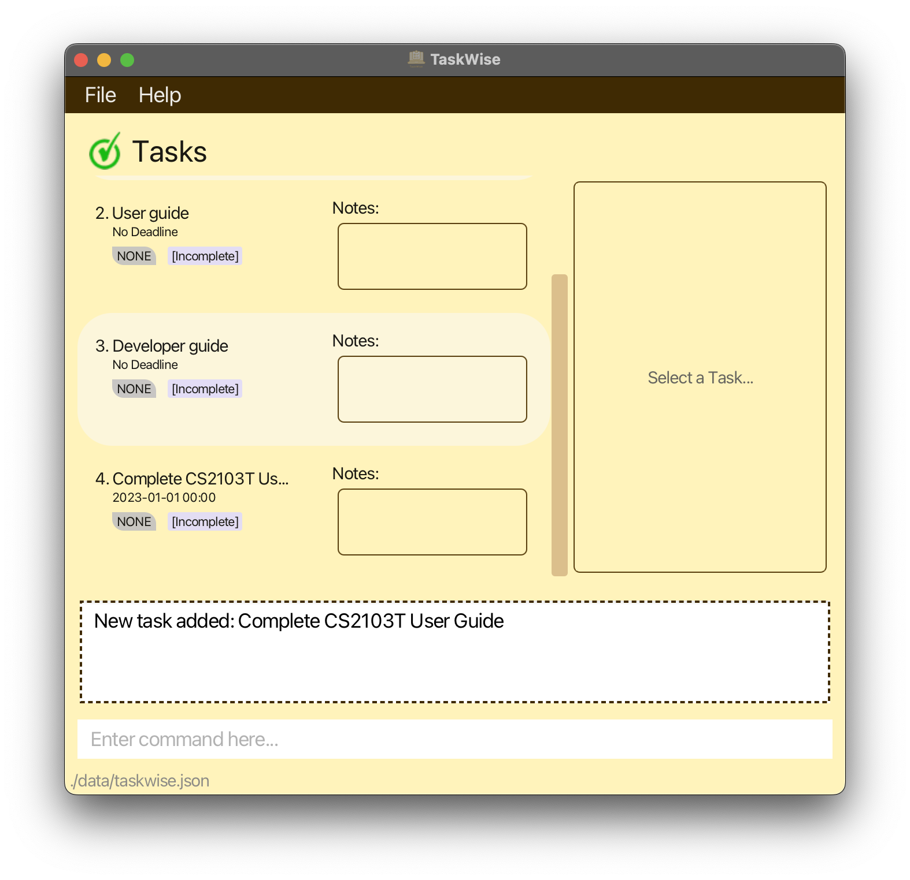

Congratulations! You have just added your first task to track into TaskWise!

[[Jump to Tutorial]](#tutorial)

[[Jump to Add Task Feature]](#add-tasks)

## Marking Your First Task

After working tirelessly together with your teammates, you managed to complete your User Guide. Hooray! Time to check that item off your to-do list!

Hold on a moment! TaskWise can handle that for you! Simply type in the command `mark 4` into the text box, before pressing the "Enter" or "Return" key.


This marks the task you created in the previous step as completed.

If successful, you should be able to see the following on your window after you scroll to the end of the task list!


Nice job! You have just marked the first of many tasks in TaskWise!

[[Jump to Tutorial]](#tutorial)

[[Jump to Mark Task Feature]](#mark-tasks-as-complete)

## Clearing Default Tasks

Now that you have added and marked your first task, you should be more familiar with TaskWise's user interface! Do look through the steps again if you feel confused. Otherwise, you can start to use TaskWise to add your own tasks. You may wish to clear the default tasks that are in TaskWise when you first open them up.

Just type in the `clear` command into the text box, before pressing on the "Enter" or "Return" key. You can now use TaskWise as you wish, on a clean slate!

| Before                                                 | After                                                |
|--------------------------------------------------------|------------------------------------------------------|
|  | 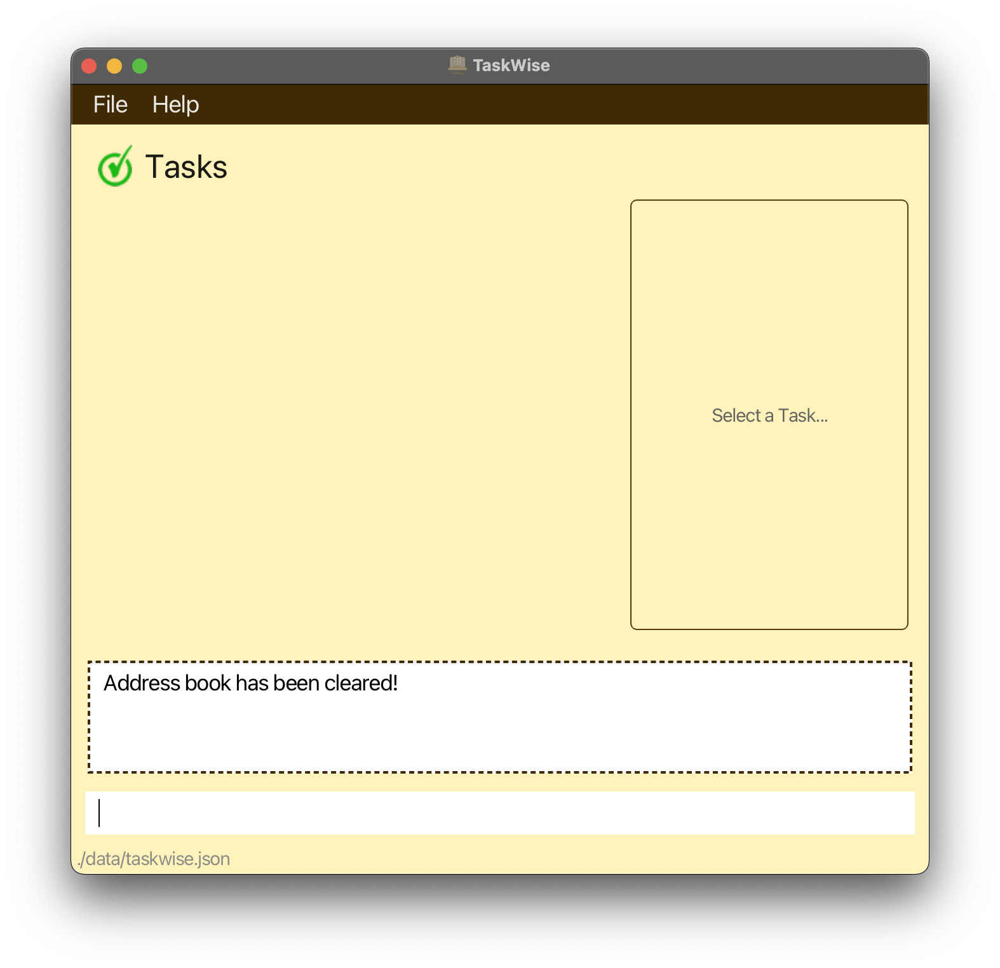 |

<div markdown="span" class="alert alert-danger">
:bangbang: The `clear` action is irreversible and permanent! Exercise extreme caution when using this command!
</div>

Rejoice! You have completed the Tutorial on TaskWise.

You are now officially a TaskWise Wizard, ready to use TaskWise to enhance your workflows and manage your project tasks in CS2103T!

[[Jump to Tutorial]](#tutorial)

[[Jump to Clear Task Feature]](#clear-all-tasks)

# Features

Looking for a more detailed explanation of what commands TaskWise can understand? Click [here](#add-tasks) to jump straight to it!

Otherwise, read on to find out more about the features that TaskWise offers!

[[Jump to Table of Content]](#table-of-content)

## Prefixes

Now, before we start with the features proper, let's introduce an important concept in the usage of TaskWise: **Prefixes**!

Prefixes allow you to specify certain important values to TaskWise while you are entering any command into the command box.

Remember the command that was previously used in the tutorial?

```
add t/Complete CS2103T User Guide d/01-01-2023
```

The task created by this command contains information about the **task's description** and the **deadline** of the associated task.

This is denoted by the `t/` and `d/` prefixes respectively.

Now, with the power of prefixes, in the same command, you can add even more useful information using the same command!

One such prefix would be the `p/` command, allowing you to change the **priority level of the task** that is being created.

After all, you wouldn't want to miss the most important submission worth 50% of your grade because you didn't see it among the mountain of other tasks you have, right?

```
add t/Complete CS2103T User Guide d/01-01-2023 p/high
```

By adding the `p/` prefix into the same command, you can now create the task within TaskWise, with a priority level set to `high` instead of a priority level of `none`.

**Table of Prefixes**

Here is a table of all available prefixes you can use within TaskWise:

| Prefixes | Description                                                                |
|----------|----------------------------------------------------------------------------|
| `t/`     | The prefix used to indicate the description of the task.                   |
| `d/`     | The prefix used to indicate the deadline of the task.                      |
| `p/`     | The prefix used to indicate the priority of the task.                      |
| `m/`     | The prefix used to indicate the member you wish to assign to the task.     |
| `n/`     | The prefix used to indicate the note you wish to associate with the task.  |
| `o/`     | The prefix used to indicate the order you wish to sort the task list by.   |
| `ty/`    | The prefix used to indicate the type you wish to sort the task list by.    |

If these prefixes do not make sense to you at this moment, fret not! More information on the prefixes will be provided to you as you use them in the upcoming sections!

[[Jump to Features]](#features)

## Getting Help

If you ever feel overwhelmed by the number of commands TaskWise has, worry not! Whenever you need to refer back to this guide, simply type in the `help` command, and TaskWise will give you the necessary link to come back to this guide!

**Format**

Simply type in the following command:

|                         Help Command                          |
|:-------------------------------------------------------------:|
|  |
|                            `help`                             |

to view a **popup window** with a link to our user guide in it!

| Before                                       | After                                      |
|----------------------------------------------|--------------------------------------------|
| 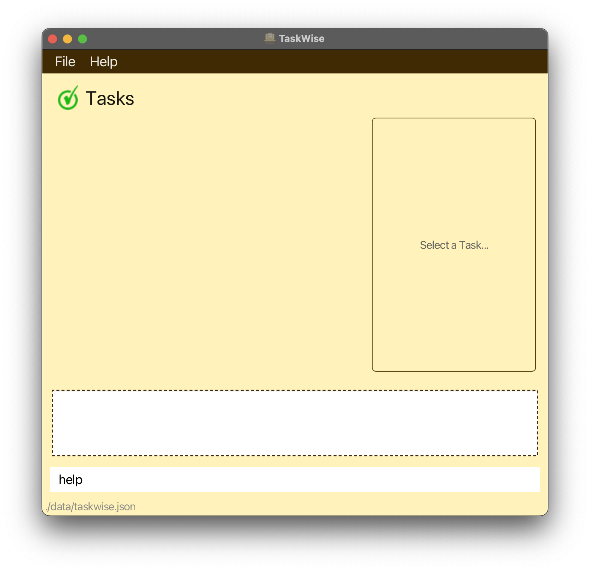 |  |

### Parameter(s)

The `help` command does not require any parameters; simply type in the `help` command and get all your questions answered!

<div markdown="span" class="alert alert-info">
:information_source: If you accidentally, or intentionally, enter any number of parameters with the `help` command, they will be ignored and the command will work as usual!
</div>

[[Jump to Features]](#features)

## Add Tasks

If you recall, you have already seen this feature in the tutorial! Fret not, you can always head over to [here](#adding-your-first-task) if you need a quick recap on adding tasks.

Now that you have learnt about adding tasks in TaskWise, let's take it to the next level! While adding tasks with a deadline into TaskWise may be useful to track tasks and their respective deadlines, TaskWise can help you keep track of so much more!

**Format**

Adding of tasks consists of 1 compulsory parameter (`TASK_DESCRIPTION`) and 3 optional parameters (`DEADLINE`, `PRIORITY`, `MEMBER`)!

|                            Add Command                            |
|:-----------------------------------------------------------------:|
|        |
| `add t/[TASK_DESCRIPTION] {d/[DEADLINE] p/[PRIORITY] m/[MEMBER]}` |

<div markdown="span" class="alert alert-info">
:information_source: The parameters in { curly braces } such as `d/[deadline]`, `p/[priority]` and `m/[member]` are OPTIONAL! They are not necessary for the task to be added, and can be arranged in ANY order.
<br/><br/>
You can always edit the default values of these optional parameters using the [***edit command***](#edit-tasks).
</div>

<div markdown="span" class="alert alert-info">
:information_source: You can add a maximum of 1 deadline and 1 priority but more than 1 member to a task!
</div>

### Parameter(s)

**TASK_DESCRIPTION**

This is all you really need to add a task! It is the description of your task that you want to keep track of, and it is compulsory for it to be filled out before your task successfully gets added to TaskWise.

ANY character is allowed, except for blanks and `/`.

<div markdown="span" class="alert alert-warning">
:warning: Due to the current limitations of the features provided in TaskWise in regard to the capitalisation of Task Description, you are encouraged to be consistent with the capitalisation of your Task Descriptions of the Tasks that you create!
<br/><br/>
Refer to <a href="https://ay2324s1-cs2103t-t17-1.github.io/tp/UserGuide.html#case-insensitive-ordering-of-members">this</a> section for more information on this issue! Rest assured that we are working hard to improve your user experience, and we appreciate your patience on this issue while we work on an appropriate fix for this issue!
</div>

**DEADLINE**

This is optional to include when you add a task. However, if you would like to add the deadline of a task, ensure that they adhere to the following formats:

| Format             | Description                                                                          |
|--------------------|--------------------------------------------------------------------------------------|
| `dd-mm-yyyy`       | The date, month, and year of your deadline                                           |
| `dd-mm-yyyy HH:mm` | The date, month and year as well as the hour and minute in 24 hours of your deadline |

Do note that you are able to add deadlines for tasks that are before the present date in order to keep track of submissions even after their deadline has passed!

<div markdown="span" class="alert alert-info">
:information_source: You can use the `-` OR `/` between the date, month and year inputs.
You can use the `:` OR `-` OR nothing between the hour and minute of your time inputs. Lastly, your date, month, hour and minute must be 2 digits, while your year must be 4 digits long. 
</div>

**PRIORITY**

This is also an optional field! Your tasks will have a default priority of `None`, if you do not assign a priority. However, if you wish to assign a priority to a task, you can simply enter 1 of the 4 priority levels:

- `none`
- `low`
- `medium`
- `high`

each corresponding to the stated priority levels (e.g. `low` corresponds to `Low` priority)!

Priority is not case-sensitive!

**MEMBER**

This is the last optional field of the `add` command. You can assign 1 or more members to a task. ANY character is allowed, except for blanks and `/`.

<div markdown="span" class="alert alert-warning">
:warning: By default, the list of members added is also sorted using the same algorithm that is used to sort the tasks by Task Description! You are advised to be consistent in your use of capitalisation in the name of the members you add to your task!
<br/><br/>
Refer to <a href="https://ay2324s1-cs2103t-t17-1.github.io/tp/UserGuide.html#case-insensitive-ordering-of-members">this</a> section for more information on this issue! Rest assured that we are working hard on fixing this issue to make your TaskWise experience a more enjoyable and productive one!
</div>

**Examples of correct usage**

* `add t/Fix User Interface`
* `add t/Developer Guide p/medium`
* `add t/OP2 Meeting d/01-01-2023 m/ALL p/high`
* `add t/User Guide d/04-11-2023 2100 m/may m/sean m/justin m/george m/seb p/high`

**Expected Output**

Click [here](#adding-your-first-task) to refer to the quick start guide for `add` command to see an example of the expected output!

**Common Mistakes**

When there is an error, the instruction with the proper use of the command will be given to you!

Head over to the [Task-Related Questions](#task-related-questions) section to find out more about what the common mistakes are!

### Limitations

Currently, TaskWise allows us to only add tasks that are of different names whether parameters such as deadline, priority, status or member are different. We acknowledge that there may be some inconvenience faced and would love to help you workaround this limitation!

**Numbering**

If you have tasks that you wish to add with the same description `CS2103T Meeting`, consider numbering them. For example, `CS2103T Meeting 1`, `CS2103T Meeting 2`, `CS2103T Meeting 3` etc. With the numbering, the task descriptions will each be unique, and you can have different deadlines, priority levels, status and members attributed to them!

**Deletion**

Another way you can tackle this problem is to [delete](#delete-tasks) a task that was already completed, instead of leaving it in TaskWise marked as `[Complete]`. That way, you can add the task of that same description, with perhaps a different deadline and `[Incomplete]` status.

There we go! With these workarounds, you can defy the limitations of TaskWise! Do refer to our [planned enhancements](#planned-enhancements) if you are interested to know more about how we plan to enhance this feature to allow for adding tasks of the same description with different parameters.

[[Jump to Features]](#features)

## Mark Tasks as Complete

If you need a quick recap on what you can do with the `mark` command, refer to [here](#marking-your-first-task).

**Format**

The `mark` command only consists of 1 parameter, the `TASK_NUMBER`, which is the number that you see associated with each task in the task list.

|                         Mark Command                          |
|:-------------------------------------------------------------:|
|  |
|                     `mark [TASK_NUMBER]`                      |

### Parameters

**TASK_NUMBER**

Acceptable values to use with the `mark` command will therefore be integers within a range from 1 to the total number of tasks you currently have in TaskWise!

**Examples of correct usage**

- `mark 1`

**Expected Output**

Click [here](#marking-your-first-task) to refer to the quick start guide for `mark` command to see an example of the expected output.

**Common Mistakes**

When there is an error, the instruction with the proper use of the command will be given to you!

Head over to the [Task-Related Questions](#task-related-questions) section to find out more about what the common mistakes are!

[[Jump to Features]](#features)

## Mark Tasks as Incomplete

Oh dear, it seems like there remain some additional parts that were left out after you marked a task as complete! Well, let's get back to tracking that task by simply marking it back as incomplete!

**Format**

The `unmark` command only consists of 1 parameter, the `TASK_NUMBER`, which is the number that you see associated with each task in the task list.

|                         Unmark Command                          |
|:---------------------------------------------------------------:|
|  |
|                     `unmark [TASK_NUMBER]`                      |

### Parameters

**TASK_NUMBER**

Acceptable values to use with the `unmark` command will therefore be integers within a range from 1 to the total number of tasks you currently have in TaskWise!

**Examples of correct usage**

- `unmark 1`

**Expected output**

To unmark the first task in the list using the example stated above, key in `unmark 1` and press the "Enter" or "Return" key.

| Before                                        | After                                       |
|-----------------------------------------------|---------------------------------------------|
| 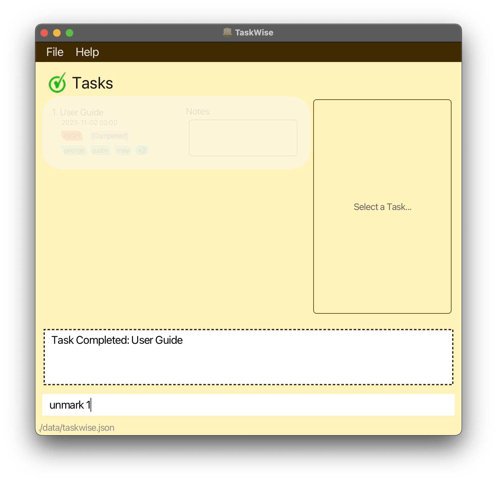 |  |

**Common Mistakes**

When there is an error, the instruction with the proper use of the command will be given to you!

Head over to the [Task-Related Questions](#task-related-questions) section to find out more about what the common mistakes are!

[[Jump to Features]](#features)

## Add Notes to Tasks

If you might have additional information about the tasks that you want to note down, TaskWise has got you covered! With the `note` command, you can attach a note to a task, which can be short or _looooong_, it's completely up to you!

**Format**

The `note` command is simple, just key in the following format:

|                         Note Command                          |
|:-------------------------------------------------------------:|
|  |
|                 `note [TASK_NUMBER] n/[NOTE]`                 |

### Parameters

**TASK_NUMBER**

Acceptable values for `TASK_NUMBER` would be integers within a range of 1 to the number of tasks that you have in TaskWise.

**NOTE**

You should also make sure the `NOTE` does not contain the `/` symbol, as it might be confused with the prefix command. TaskWise believes in keeping things simple after all!

**Example**

- note 1 n/check the rubrics
- note 4 n/make sure that all the deliverables are included in the team directory before the final submission

**Common Mistakes**

When there is an error, the instruction with the proper use of the command will be given to you!

Head over to the [Task-Related Questions](#task-related-questions) section to find out more about what the common mistakes are!

[[Jump to Features]](#features)

## Edit Tasks

Oopsie! It seems that you might have made a mistake with the details of an already created task, or have new updates for that task! Don't worry, you also have the power to edit those tasks with new details with the `edit` command!

**Format**

Here is how you can make use of `edit`!

There is 1 compulsory parameter (`TASK_NUMBER`) and 5 optional parameters (`NEW_TASK_DESCRIPTION`, `NEW_DEADLINE`, `NEW_PRIORITY_LEVEL`, `MEMBER_NAME`, `NOTE`) whereby at least 1 of these parameters is required to be present.

|                                                    Edit Command                                                    |
|:------------------------------------------------------------------------------------------------------------------:|
|                                                       |
| `edit [TASK_NUMBER] { t/[NEW_TASK_DESCRIPTION] d/[NEW_DEADLINE] p/[NEW_PRIORITY_LEVEL] m/[MEMBER_NAME] n/[NOTE] }` |

<div markdown="span" class="alert alert-info">
:information_source: The parameters in { curly braces } such as d/[deadline], p/[priority] and m/[member] are OPTIONAL! The ordering does not matter at all!

For fields that you omit, TaskWise will retain the original information from the original task.
</div>

<div markdown="span" class="alert alert-info">
:information_source: You can edit a maximum of 1 deadline and 1 priority but assign more than 1 member to a task!
</div>

<div markdown="span" class="alert alert-warning">
:warning: Editing any of the parameters will overwrite the corresponding parameters that were attached to your task. As a workaround, if you wish to edit a typo in the task's members, notes or descriptions or maybe to append more members to the task, you would have to rewrite the field that is in the original task.
</div>

To address this hassle of having to rewrite the field just to edit a typo or append to the task's fields, we are looking to introduce new modes of editing in the [future](#edit-command---different-modes)!

### Parameter(s)

Unsure about the format to use for each parameter? We got you!

**TASK_DESCRIPTION**

This is the description of the task that you want to keep track of. You may wish to change its details using this command.

ANY character is allowed, except for blanks and `/`.

<div markdown="span" class="alert alert-warning">
:warning: Due to the current limitations of the features provided in TaskWise in regard to the capitalisation of Task Description, you are encouraged to be consistent with the capitalisation of your Task Descriptions of the Tasks that you create!
<br/><br/>
Refer to <a href="https://ay2324s1-cs2103t-t17-1.github.io/tp/UserGuide.html#case-insensitive-sort">this</a> section for more information on this issue! Rest assured that we are working hard to improve your user experience, and we appreciate your patience on this issue while we work on an appropriate fix for this issue!
</div>

**DEADLINE**

If you would like to edit the deadline of your task, refer to the following formats:

| Format             | Description                                                                          |
|--------------------|--------------------------------------------------------------------------------------|
| `dd-mm-yyyy`       | The date, month, and year of your deadline                                           |
| `dd-mm-yyyy HH:mm` | The date, month and year as well as the hour and minute in 24 hours of your deadline |

Do note that you are able to edit deadlines for tasks to a date before the present date in order to keep track of submissions even after their deadline has passed!

<div markdown="span" class="alert alert-info">
:information_source: You can use the `-` or `/` between the date, month and year inputs.
You can use the `:` or `-` or nothing between the hour and minute of your time inputs. Lastly, your date, month, hour and minute must be 2 digits, while your year must be 4 digits long. 
</div>

**PRIORITY**

Your tasks will have a default priority of `None`, if you have not assigned a priority. However, if you want to change its level of importance, you can simply enter 1 of the 4 priority levels into the `edit` command:

- `none`
- `low`
- `medium`
- `high`

each corresponding to the stated priority levels (e.g. `low` corresponds to `Low` priority)!

Priority is not case-sensitive!

**MEMBER**

You can assign 1 or more member to a task. ANY character is allowed, except for blanks and `/`.

Do note that editing members using this command will overwrite any existing members, if any, previously associated with the task.

<div markdown="span" class="alert alert-warning">
:warning: By default, the edited list of members is also sorted using the same algorithm that is used to sort the tasks by Task Description! You are advised to be consistent in your use of capitalisation in the name of the members you add to your task!
<br/><br/>
Refer to <a href="https://ay2324s1-cs2103t-t17-1.github.io/tp/UserGuide.html#case-insensitive-ordering-of-members">this</a> section for more information on this issue! Rest assured that we are working hard on fixing this issue to make your TaskWise experience a more enjoyable and productive one!
</div>

**NOTE**

This is the last field of the `edit` command that you can modify. ANY character is allowed, except for `/`.

**Examples of correct usage**

* `edit 1 t/New Task Description`
* `edit 1 m/John m/Jane m/Mary`
* `edit 1 p/Medium`
* `edit 1 d/09-09-2023 0900`
* `edit 1 n/Check rubrics`
* `edit 2 t/Another Task Description m/Janet m/Harry p/high d/08-09-2023 19:00 n/Check rubrics`
* `edit 1 t/Complete OP2 Presentatation d/02-11-2023 m/may m/sean m/justin m/george m/seb m/harry p/high`

**Expected Output**

If all goes well, you should see your specified task being edited and replaced with the new information.

This will be what you will see displayed for the following command when you edit the first task in your list: `edit 1 t/Complete OP2 Presentatation d/02-11-2023 m/may m/sean m/justin m/george m/seb m/harry p/high`

| Before                                      | After                                     |
|---------------------------------------------|-------------------------------------------|
| 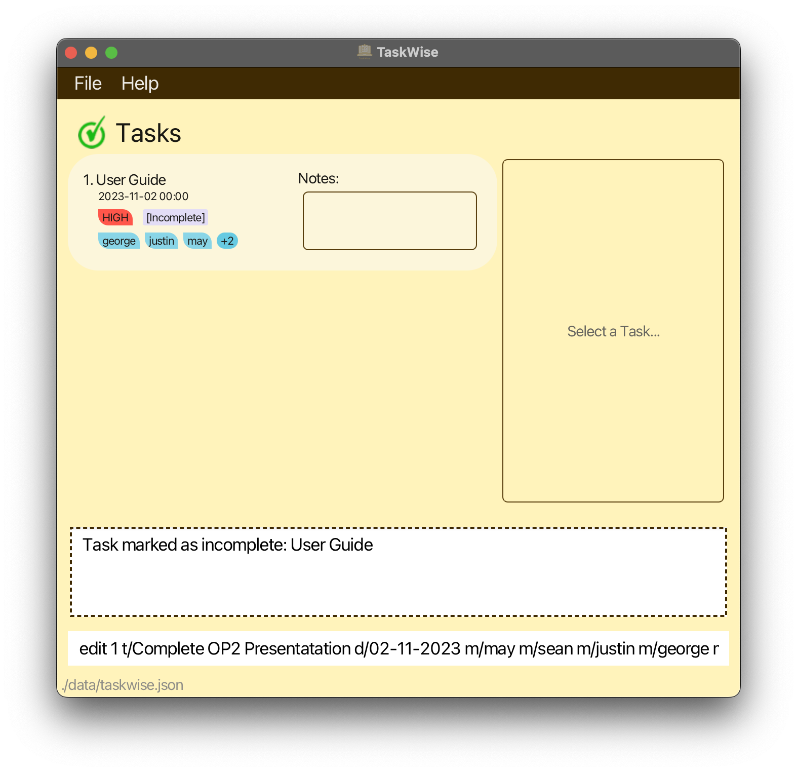 |  |

<div markdown="span" class="alert alert-info">
:information_source: Unable to view the full description of your task? That may be because the description is way too long! You could fix this by resizing your window to make it bigger, clicking on the task of interest to view it on the side panel, or using the <a href="https://ay2324s1-cs2103t-t17-1.github.io/tp/UserGuide.html#view-a-task"><code>view</code> command</a>!
</div>

**Common Mistakes**

When there is an error, the instruction with the proper use of the command will be given to you!

Head over to the [Task-Related Questions](#task-related-questions) section to find out more about what the common mistakes are!

[[Jump to Features]](#features)

## View a Task

In some cases, you can be so productive that the `note` you added to a task is so long that it is cut off from the display, or you assign so many `member`(s) to a task that some are being cut off from the display. In that case, you can use the `view` command to see the full information of the task with this simple command!

**Format**

Viewing a task has one and only one compulsory parameter (`TASK_NUMBER`).

|                         View Command                          |
|:-------------------------------------------------------------:|
|  |
|                     `view [TASK_NUMBER]`                      |

### Parameter

The only parameter here is your task number! Do ensure that your task number exists here and is amongst those task numbers that the task list has!

**Expected Output**

Say, you wish to view the information of the first task on your task list! Key in the command `view 1` into the command box and press the "Enter" or "Return" key! You should see the following changes made to your GUI:

| Before                                      | After                                     |
|---------------------------------------------|-------------------------------------------|
|  | 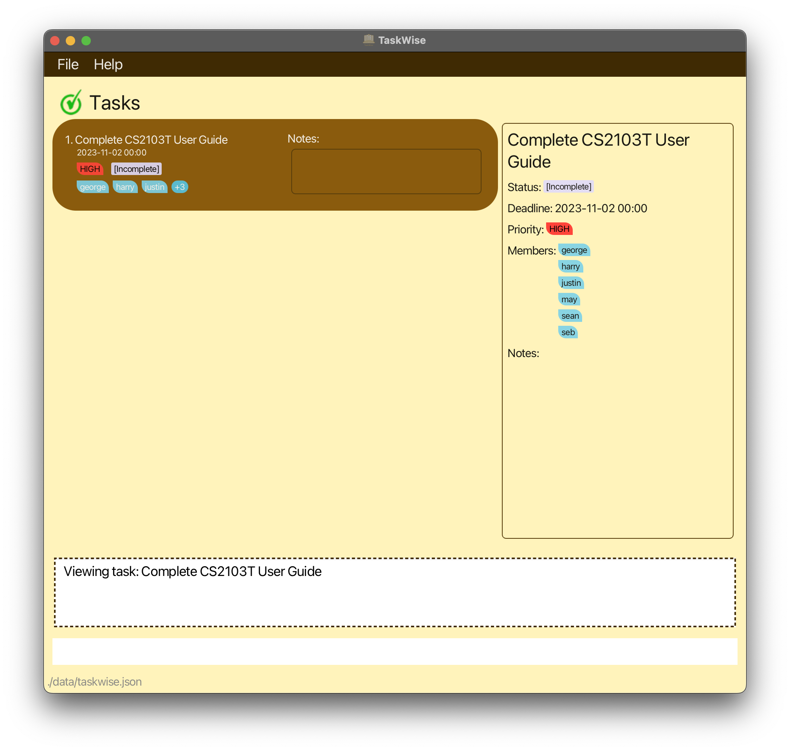 |

_Voilà_, now you get to view the full complete information on the side panel!

**Common Mistakes**

When there is an error, the instruction with the proper use of the command will be given to you!

Head over to the [Task-Related Questions](#task-related-questions) section to find out more about what the common mistakes are!

[[Jump to Features]](#features)

## Find a Task

Looking for a particular task that has been added into TaskWise? Well, we've made finding a task in TaskWise as simple as possible, with the `find` command!

**Format**

The only parameter you will have here is the keywords that you are trying to find!

|                         Find Command                          |
|:-------------------------------------------------------------:|
|  |
|                       `find [KEYWORD]`                        |

**Example**

* `find OP2`
* `find meeting`
* `find todo`

**Expected Output**

TaskWise will filter out the tasks containing the `keywords` specified!

For example, you have a list with the tasks `Complete OP2 Presentation` and `Complete OP3 Presentation`. You wish to find the task with the term "`OP2`" in its description, so, all you need to do is simply key in the command `find OP2` in the command box and press the "Enter" or "Return" key! You should be able to see the following changes reflected on the GUI:

| Before                                      | After                                     |
|---------------------------------------------|-------------------------------------------|
|  |  |

Tasks with the term "`OP2`" in the description will now be shown to you!

Note that for now, you can only find by the task `description` so for your convenience, do include the most important information in your `description`, and reserve `note` for additional information. If you want to find by completion `status`, `priority` or `deadline`, you can look at the [Sort Command](#sort-tasks).

[[Jump to Features]](#features)

## See All Tasks

Hmm, seems like your vision is clouded on a selected few tasks out of all the tasks in TaskWise. Let's clear up that vision up see the rest of the tasks, shall we?

**Format**

This feature has no parameters involved! Simply type the `list` command. It is case-sensitive (i.e. `List` and `LIST` will not be recognised as valid commands!).

|                         List Command                          |
|:-------------------------------------------------------------:|
|  |
|                            `list`                             |

<div markdown="span" class="alert alert-info">
:information_source: If you accidentally, or intentionally, enter any number of parameters with the `list` command, they will be ignored and the command will work as usual!
</div>

**Example**

* `list`

**Expected Output**

Following from the [example given above](#find-a-task) in the `find` command, say you are done looking for the "`OP2`" task, but you realise: "Where are the rest of my tasks?????". Well, simply key in the command `list` into the command box and hit Enter or Return to bring back the rest of the tasks to your view!

| Before                                      | After                                     |
|---------------------------------------------|-------------------------------------------|
| 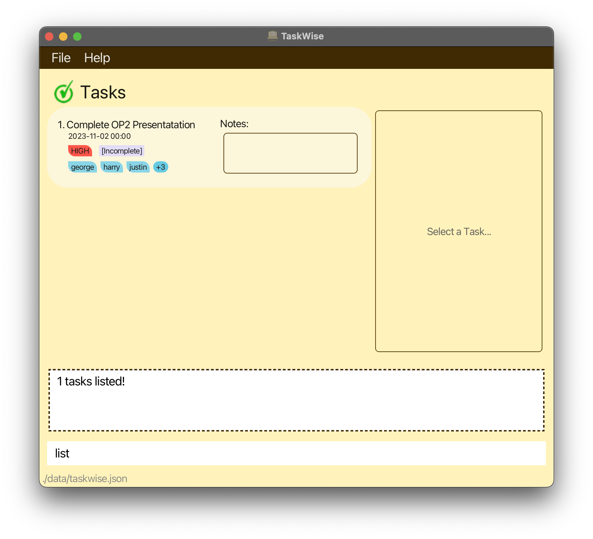 | 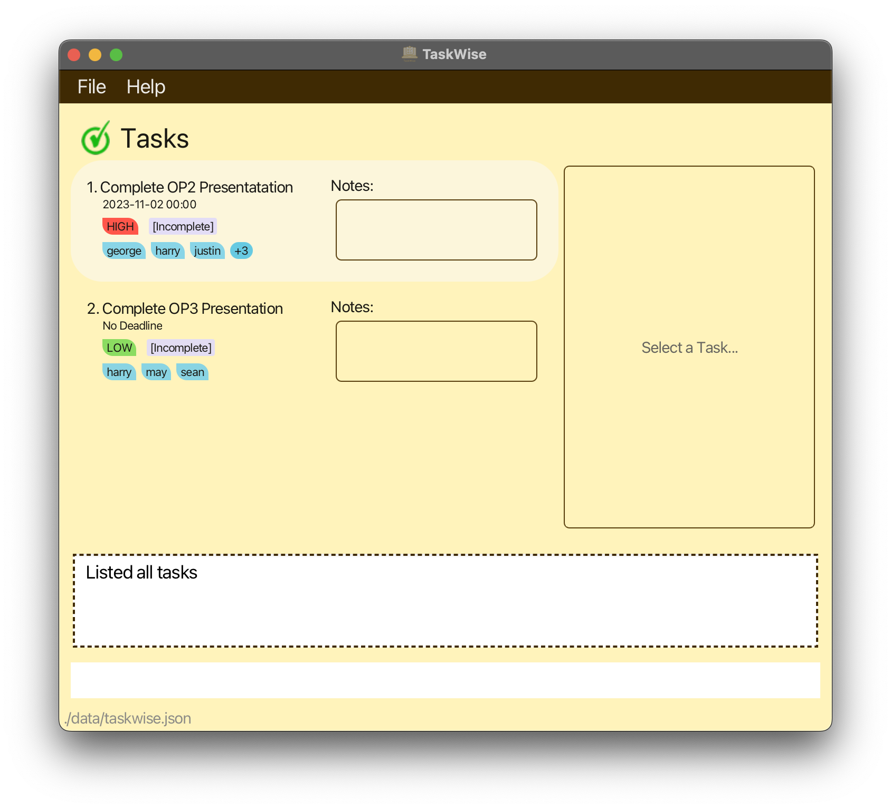 |

[[Jump to Features]](#features)

## Sort Tasks

Creating, editing and prioritising tasks is nice and all, but what is the point if you are unable to redefine the order of your task, and personalise it to your needs?

With the **Sort** feature, you can do exactly that! One simple command is all you really need to organise your task list in ascending order by task priority, or descending order by task deadlines! **The possibilities are endless!**

How can you do that? It's simple! Read on to find out more!

**Format**

The `sort` command can be broken up into 3 parts: the command word (`sort`), the sort **order** (`o/[SORT_ORDER]`) and sort **type** (`ty/[SORT_TYPE]`). Here is a visual representation of the `sort` command!

|                         Sort Command                          |
|:-------------------------------------------------------------:|
|  |
|             `sort o/[SORT_ORDER] ty/[SORT_TYPE]`              |

So, how can you sort your task list?

### Parameter(s)

**SORT_ORDER**

Firstly, you would need to define the `SORT_ORDER`! `SORT_ORDER` is used to refer to whether the task list will be sorted in _ascending_ or _descending_ order!

Currently, the recognised `SORT_ORDER` parameters are as follows:

| Parameter                     | Description                                           |
|-------------------------------|-------------------------------------------------------|
| `a` OR `asc` OR `ascending`   | Causes the task list to be sorted in ascending order  |
| `d` OR `desc` OR `descending` | Causes the task list to eb sorted in descending order |

<div markdown="span" class="alert alert-info">
:information_source: The phrase `X OR Y`, where `X` and `Y` refer to possible parameters for sort **order**, is used to denote the fact that either `X` or `Y` are accepted as valid parameter values, but **NOT** both at the same time!
</div>

**SORT_TYPE**

Next, you need to define the `SORT_TYPE`! `SORT_TYPE` is used to refer to the field in which you wish to sort your task list by!

The recognised `SORT_TYPE` parameters are as follows:

| Parameter                                                | Description                            |
|----------------------------------------------------------|----------------------------------------|
| `t` OR `td` OR `task` OR `tsk dsc` OR `task description` | Sorts the list by the task description |
| `p` OR `pr` OR `pri` OR `prior` OR `priority`            | Sorts the list by the task priority    |
| `d` OR `dl` OR `deadln` OR `deadline`                    | Sorts the list by the task deadline    |
| `s` OR `st` OR `stat` OR `status`                        | Sorts the list by the task status      |

<div markdown="span" class="alert alert-info">
:information_source: The phrase `X OR Y`, where `X` and `Y` refer to possible parameters for sort **type**, is used to denote the fact that either `X` or `Y` are accepted as valid parameter values, but **NOT** both at the same time!
</div>

By using these two parameters, you are able to sort the task list in ascending or descending order, by the task description, priority, deadline or status!

**Examples of correct usage**

Now that you have learnt what parameters are accepted by the `sort` command, here are some more examples of how sort can be properly used to help you achieve the order which you are going for!

* `sort o/a ty/d`: Sorts the task list in ascending order by the task deadline
* `sort o/d ty/pr`: Sorts the task list in descending order by the task priority
* `sort o/a ty/status`: Sort the task list in ascending order by the task status
* `sort o/d ty/task description`: Sort the task list in descending order by the task description

**Expected Output**

In particular, let us examine the first example `sort o/a ty/pr`, which sorts the task list in ascending order by the task priority!

Initially, we can see from the below image that the tasks are not really sorted in any order!


Now, due to the sheer number of assignments and project tasks, you wish to find out what tasks are the most important, so that you are able to get them out of the way as quickly as possible!

How can you do that? Simply sort the list in ascending order by task deadline!

After entering the aforementioned command into the command box and pressing the "Enter" or "Return" key, you will be able to see that the task list will magically be sorted in ascending order by task deadline! Isn't this amazing?!

| Before                                      | After                                     |
|---------------------------------------------|-------------------------------------------|
|  | 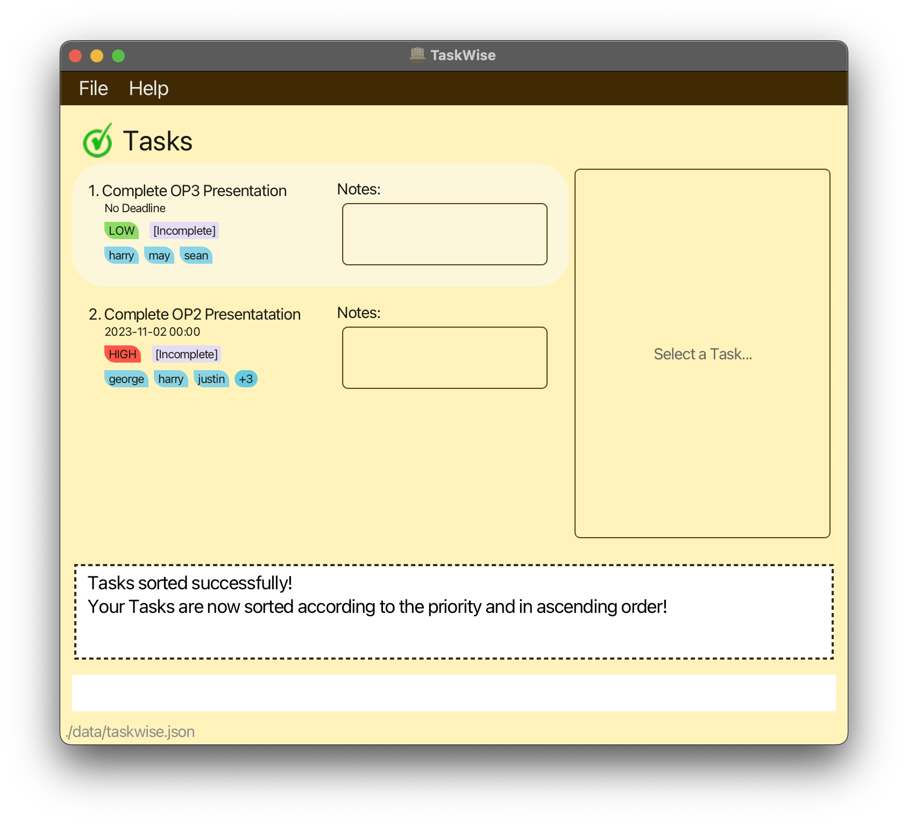 |

<div markdown="span" class="alert alert-info">
:information_source: If you attempt to sort your task list by the same order in which it is already sorted in, you will not be able to see any changes made to the task list!
</div>

**Common Mistakes**

If you key in any other values into the `SORT_ORDER` or `SORT_TYPE` parameters that are not recognised by TaskWise, an error message will show up, telling you that you have entered in some unrecognised value as parameters for `SORT_ORDER` or `SORT_TYPE`!

For example, if you key in the command `sort o/ascendinggg ty/pr`, you will get the following error message that alerts you that `ascendinggg` is not a recognised sort **order**!

**Limitations**

Currently, due to how the `sort` command treats Task Descriptions that begin with lowercase and uppercase characters differently, you are advised to be **consistent in the capitalisation of your Task Description**!

If the sort is done in an ascending manner, and if your tasks are not consistent with the capitalisation of the Task Description, you may realise that your task list will be sorted in such a way that the Descriptions that begin with lowercase character would be at the top of the list, followed by those that start with uppercase characters!

For example, if your list looks like this:

* `post on the forum for help`
* `complete OP2`
* `Complete OP3`

after sorting your list in ascending order by the Task Description, it will now look like this:

* `complete OP2`
* `post on the forum for help`
* `Complete OP3`

rather than:

* `complete OP2`
* `Complete OP3`
* `post on the forum for help`

which is probably what you expect the command to do!

This is also true if the sort was done in descending order!

We aim to remedy this behaviour in an upcoming release of TaskWise, whereby this unexpected behaviour will be fixed!

[[Jump to Features]](#features)

## Delete Tasks

After submitting all the deliverables you need for a certain milestone, you sit back and heave a sigh of relief. It's finally done!

Time to clean up TaskWise!

**Format**

The `delete` command only consists of 1 parameter, the `TASK_NUMBER`, which is the number that you see associated with each task in the task list.

|                         Delete Command                          |
|:---------------------------------------------------------------:|
|  |
|                     `delete [TASK_NUMBER]`                      |

<div markdown="span" class="alert alert-danger">
:bangbang: Please note that deleting a task from TaskWise is permanent, and cannot be undone! Be sure about what you are trying to do before using the `delete` command!
</div>

### Parameter(s)

**TASK_NUMBER**

Acceptable values to use with the `delete` command will therefore be integers within a range from 1 to the total number of tasks you currently have in TaskWise!

**Example**

- `delete 1`

**Expected Output**

Now, we are done with the first task `Complete OP3 Presentation` and we want to remove it from our view. How can we do that? Simple! Key in the command `delete 1` (which refers to the `Complete OP3 Presentation` task!) and press the "Enter" or "Return" key to delete the task!

| Before                                        | After                                       |
|-----------------------------------------------|---------------------------------------------|
| 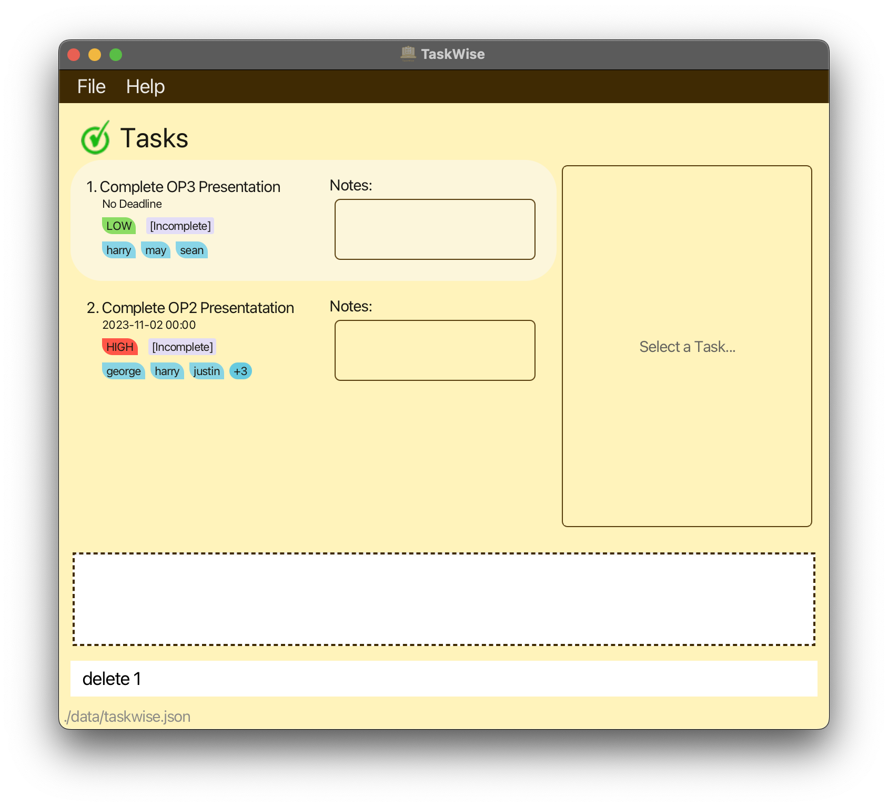 | 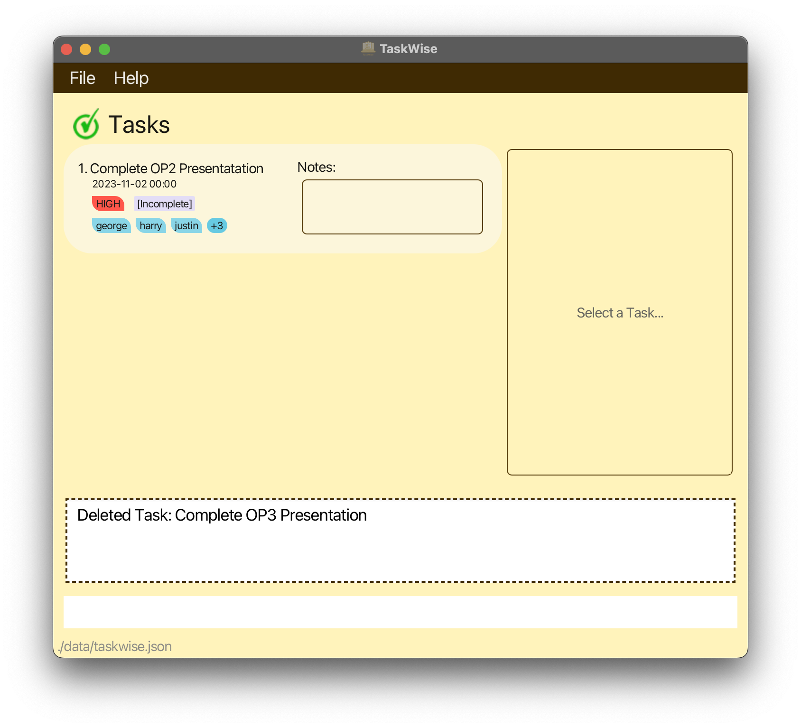 |

The task `Complete OP3 Presentation` is now deleted from your task list!

**Common Mistakes**

When there is an error, the instruction with the proper use of the command will be given to you!

Head over to the [Task-Related Questions](#task-related-questions) section to find out more about what the common mistakes are!

[[Jump to Features]](#features)

## Clear All Tasks

At the end of your project, you are finally free of all its tasks! You may wish to put it all behind you. With the `clear` command, you can do just that!

**Format**

Enter in the `clear` command in the command box to clear out your task list and delete all saved tasks!

|                         Clear Command                          |
|:--------------------------------------------------------------:|
|  |
|                            `clear`                             |

<div markdown="span" class="alert alert-danger">
:bangbang: Please note that clearing tasks from TaskWise is permanent and irreversible. It will clear ALL your tasks.
</div>

### Parameters

This feature has no parameters involved! Simply type the `clear` command. It is case-sensitive (i.e. `Clear` and `CLEAR` will not be recognised as valid commands!).

<div markdown="span" class="alert alert-info">
:information_source: If you accidentally, or intentionally, enter any number of parameters with the `clear` command, they will be ignored and the command will work as usual!
</div>

**Example**

* `clear`

**Expected Output**

Click [here](#clearing-default-tasks) to refer to the quick start guide for `clear` command to see an example of the expected output.

[[Jump to Features]](#features)

## Command Summary

| Commands                                                                                                                                   | Description                                                                                                                                             |
|--------------------------------------------------------------------------------------------------------------------------------------------|---------------------------------------------------------------------------------------------------------------------------------------------------------|
| `help` ([more info](#getting-help))                                                                                                        | Open a popup that shows where users can get a link to this user guide.                                                                                  |
| `add t/[TASK_DESCRIPTION] {d/[DEADLINE] p/[PRIORITY] m/[MEMBER]}` ([more info](#add-tasks))                                                | Adds a task to the task list.                                                                                                                           |
| `mark [TASK_NUMBER]` ([more info](#mark-tasks-as-complete))                                                                                | Marks the task at a specified task number as completed.                                                                                                 |
| `unmark [TASK_NUMBER]` ([more info](#mark-tasks-as-incomplete))                                                                            | Remove the completed status from the task.                                                                                                              |
| `note [TASK_NUMBER] n/[NOTE_VALUE]` ([more info](#add-notes-to-tasks))                                                                     | Adds a note to the task at the specified task number.                                                                                                   |
| `edit [TASK_NUMBER] {t/[NEW_TASK_DESCRIPTION] d/[NEW_DEADLINE p/[NEW_PRIORITY_LEVEL] m/[MEMBER_NAME] n/[NOTE]}` ([more info](#edit-tasks)) | Edits the task at the specified task number with the new task description, new deadline, new priority level, new member(s) and new note assigned to it. |
| `view [TASK_NUMBER]` ([more info](#view-a-task))                                                                                           | Display the full complete information about the task on the side panel.                                                                                 |
| `find [KEYWORD]` ([more info](#find-a-task))                                                                                               | Displays all tasks that contains the specified keyword.                                                                                                 |
| `list` ([more info](#see-all-tasks))                                                                                                       | Displays the entire task list to the user.                                                                                                              |
| `sort o/[SORT_ORDER] ty/[SORT_TYPE]` ([more info](#sort-tasks))                                                                            | Sort tasks by a certain order and by a certain task attribute.                                                                                          |
| `delete [TASK_NUMBER]` ([more info](#delete-tasks))                                                                                        | Deletes the task from the task list.                                                                                                                    |
| `clear` ([more info](#clear-all-tasks))                                                                                                    | Clears the current task list.                                                                                                                           |

[[Jump to Features]](#features)

# Planned Enhancements

In our future releases, we are looking to improve your user experience! Here are the plans that we have in mind with regard to the limitations that surfaced in this User Guide.

## Ability To Add Tasks With The Same Description With Different Details

As of now, TaskWise allows you to add tasks with the `Description` being the unique identifier. This means that you cannot add tasks with the same description, even if their deadlines, priority, status and members involved are different!

However, we propose that in the near future, tasks with the same description but at least one different deadline, priority, status or members can be added into TaskWise. This would allow for more convenience for you, as you can create tasks with the same description, as long as its other parameters are different!

For example, if you have marked the task`CS2103T Meeting` with no deadline, priority or member, its status will change from `[Incomplete]` to `[Complete]`. Then, you can add another task with the description `CS2103T Meeting` with the same exact parameters again, since its status is different -- `[Incomplete]`.

## Inform User When Date Input Has Passed

Currently, when a user inputs a date that has already passed as a deadline for a task, TaskWise carries out the command as usual and treats the command like any other.

In the future, we intend for the user to continue to be able to use dates that have already passed as valid deadlines for their tasks, as we still wish for users to be able to add/edit tasks that have deadlines that have passed already. However, when doing so, TaskWise would prompt you and ask for confirmation whether you wish to continue adding/editing a deadline that has passed already. The task will only be created/edited should you confirm their decision to use a past date.

Also, tasks with deadlines that are in the past and are incomplete will be indicated with a red highlight, to signify that they are overdue, helping you keep track of overdue tasks that need to be completed as soon as possible!

## Edit Command - Different Modes

We seek to make it easier for you to edit your tasks!

Instead of the workaround as suggested under [Edit Tasks](#edit-tasks), the future implementation will allow you to simply append to the `notes` and `members` fields as well as editing specific fields without having to rewrite whatever that was previously in that field of the task.

To do so, there will be 3 different modes of editing:

* Append
  * Allows you to add on to whatever was already in the task.
* Edit
  * Allows you to amend that one particular section of notes or the members that were specified.
* Overwrite
  * Allows you to completely replace the previous information of that field in the specified task with what you wrote in the command.

## Improve Find Command To Find By Priority, Deadline, Members and Notes

Currently, our `find` feature only supports finding by description. Apart from that, we think your experience can be enhanced with the ability to find tasks by other attributes like `priority`, `deadline`, `member` and `note` as well with the following commands:

1. `find t/[TO_FIND]`
2. `find p/[TO_FIND]`
3. `find d/[TO_FIND]`
5. `find m/[TO_FIND]`
6. `find n/[TO_FIND]`

Furthermore, we could also allow you to combine different attributes in your find command. For example:
`find t/meeting n/check rubrics m/george`


## Case-insensitive Sort

Currently, the `sort` feature is not really user-friendly, as it sorts your tasks in a case-sensitive manner. For example, if your task list contains:

* `b Task`
* `a Task`
* `A Task`

after sorting your task list in ascending order by the task description, your task list will look like this:

* `a Task`
* `b Task`
* `A Task`

which is not the expected behaviour you might have for the `sort` feature!

In a future iteration of TaskWise, we will amend this feature to allow sorting to be done in a **case-insensitive** manner, so that, using the same example above, your task list would now look like this:

* `a Task`
* `A Task`
* `b Task`

which is the intended behaviour of the `sort` feature!

In a future release of this application, we will amend this unexpected behaviour and allow sorting to be done in a case-insensitive manner!

## Case-insensitive Ordering of Members

Currently, members added to a Task appear on the Task Card as well as the Side Panel in ascending order according to the member's name, using the same sorting process detailed above in [Case-insensitive Sort](#case-insensitive-sort)!

While there are no known workarounds for this issue, we recommend that you remain consistent in your capitalisation of the names of the members to avoid this unexpected behaviour showing up while you are using TaskWise!

We also recognise that this may be inconvenient for you, as you cannot define your personal ordering of members assigned to a particular part, and as such, we aim to amend this behaviour in a future release of TaskWise, which would allow you to define your own ordering of members for all your tasks!

# FAQ

Have some burning questions which you need answered? Here are the answers to some common questions that you may have!

## General Questions

**Q**: Is there a way for me to report a bug?  
**A**: Of course! You can create an issue about the bug [here](https://github.com/AY2324S1-CS2103T-T17-1/tp/issues). Don't forget to include details about the bug and how to reproduce it. We really appreciate your contribution!

**Q**: Is there a way for us to customise the font and the colour of the app?  
**A**: Unfortunately, we do not offer customisable features for now. However, do keep a lookout for potential updates in the future!

**Q**: Can I still use this app without an internet connection?  
**A**: Definitely! This app is designed to be used without an internet connection! Your tasks and progress will be saved on your local computer.

## Task-Related Questions

**Task Description**  
**Q**: What if I typed in the invalid task description?  
**A**: Simply ensure that your task description is non-empty and does not contain the `/` symbol.

**Deadline**  
**Q**: What if I typed in an invalid deadline?  
**A**: First, ensure that your deadline is in the right format, and it is NOT empty.

| Format                                              | Description                                                                              |
|-----------------------------------------------------|------------------------------------------------------------------------------------------|
| `dd(- OR /)mm(- OR /)yyyy`                          | The date(dd), month(mm) and year(yyyy) of your task                                      |
| `dd(- OR /)mm(- OR /)yyyy [ HHmm OR HH(: OR -)mm ]` | The date(dd), month(mm) and year(yyyy) and hour(HH), minute(mm) in 24 hours of your task |

Here are some valid examples:

- `20-01-2023`
- `20-01/2023`
- `20/01-2023 0910`
- `20-01-2023 09:10`

Note that date(dd), month(mm), hour(HH) and minute(mm) should be 2 digits, this means that instead of 1, you should key in 01 instead. The year(yyyy) should be 4 digits.

Next, ensure that your dates and times are VALID dates and times. For example, `32/12/2023` is an invalid date as it does not exist.

Lastly, check that the characters between each number are valid (refer to the format table and examples above!)

**Member**  
**Q**: What if I typed in an invalid member?  
**A**: Use the `edit` command to re-enter the members you wish to assign to the task! Do note that using `edit` will not add members to the task, but will overwrite all existing members, so do make sure you take note of existing members first and remember to add them back when you use the `edit` command!

**Note**  
**Q**: What if I typed in an invalid note?  
**A**: Simply ensure that your note does not contain the `/` symbol.

**Priority**  
**Q**: What if I typed in an invalid priority?  
**A**: Simple ensure that the priority you input is within the set of available options - `none`, `low`, `medium` and `high`. It is not case-sensitive.

**Task Number**  
**Q**: What if I typed in an invalid task number?  
**A**: Simply ensure that your task number is within the number of tasks that you have. You can locate the task number beside the task description!

For example, if there are `10` items in your task list, then make sure that you enter a number between `1` and `10` inclusive! If you enter any other number, an error will occur!

Decimal point numbers such as `1.0`, while not exactly wrong, are also not recognised by TaskWise!

[[Jump to Table of Content]](#table-of-content)
